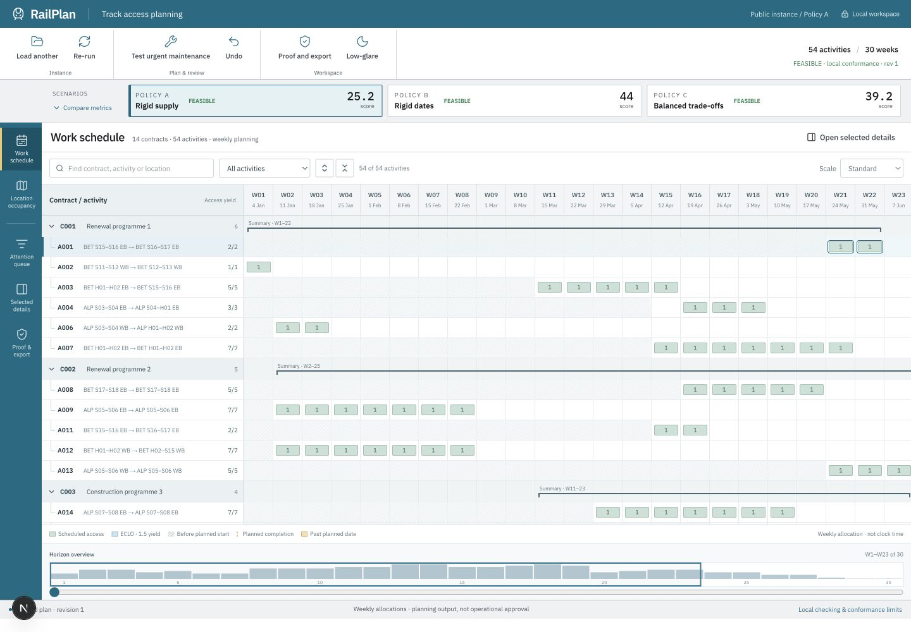

<a id="readme-top"></a>

<div align="center">
  <h1>RailPlan</h1>
  <p><strong>Railway access planning, explained.</strong></p>
  <p>A railway maintenance scheduling prototype with a native solver for Nebula X PS1.</p>
  <p>
    <a href="docs/README.md"><strong>Explore the documentation »</strong></a>
    <br /><br />
    <a href="https://railplan-nine.vercel.app/ps1">View demo</a>
    &middot;
    <a href="https://github.com/pavan2184/LTA-Hack/issues/new">Report a bug</a>
    &middot;
    <a href="https://github.com/pavan2184/LTA-Hack/issues/new">Request a feature</a>
  </p>
</div>

<p align="center">
  <a href="https://nextjs.org/"></a>
  <a href="https://react.dev/"></a>
  <a href="https://www.typescriptlang.org/"></a>
  <a href="https://vitest.dev/"></a>
</p>

<details>
  <summary>Table of Contents</summary>
  <ol>
    <li><a href="#about-the-project">About The Project</a>
      <ul><li><a href="#built-with">Built With</a></li></ul>
    </li>
    <li><a href="#getting-started">Getting Started</a>
      <ul>
        <li><a href="#prerequisites">Prerequisites</a></li>
        <li><a href="#installation">Installation</a></li>
        <li><a href="#verification">Verification</a></li>
      </ul>
    </li>
    <li><a href="#usage">Usage</a></li>
    <li><a href="#ps1-native-solver-benchmark-and-selection">PS1 Native Solver Benchmark and Selection</a></li>
    <li><a href="#roadmap">Roadmap</a></li>
    <li><a href="#contributing">Contributing</a></li>
    <li><a href="#license">License</a></li>
    <li><a href="#contact">Contact</a></li>
    <li><a href="#acknowledgments">Acknowledgments</a></li>
  </ol>
</details>

## About The Project

[](docs/design-evidence/railplan-compact-schedule.png)

Railway maintenance activities compete for limited track access. Their locations,
dependencies and completion targets interact: moving one activity can affect the
rest of the plan. RailPlan brings those decisions into one schedule workspace.

The public **`/ps1`** application accepts the challenge's eight CSV files, builds
three planning scenarios through a native CP-SAT service, and connects the weekly schedule to
placement explanations and reviewed changes. The published example contains
**54 activities, 14 contracts and a 30-week horizon**.

| Planner task | RailPlan workflow |
| --- | --- |
| See the work | Expand contracts into activities; inspect weekly access blocks, planned starts and completion targets. |
| Understand a placement | Open the shared inspector for dependencies, constraints, locations and deterministic answers. |
| Compare policies | Inspect A/B/C delay, excess capacity and early closure/late opening (ECLO) metrics. |
| Test a disruption | Reduce location capacity, inspect the proposed impact, then Apply or keep the current schedule. |
| Hand over results | Check local conformance and export nine official CSVs across the three scenarios. |

The dense desktop workspace includes a horizon navigator, linked location
occupancy, an attention queue and a low-glare mode. Narrow screens support triage,
inspection, review and export. Uploaded instances are sent to the same-origin
native service; the browser checks returned schedules before display and export.
The PS1 workflow needs no account.

**Prototype boundary:** the published PS1 instance is challenge data, not a live
railway. Our local checker is not the organiser's reference validator or an
operational approval. The separate authenticated workspace uses its own
fabricated demonstration data.

### Built With

| Layer | Technology |
| --- | --- |
| Application | Next.js 16, React 19, TypeScript 6 |
| Interface | Tailwind CSS 4, Radix UI, Zustand |
| PS1 planning | Native Python OR-Tools CP-SAT, TypeScript `@railplan/ps1` warm start and independent local checker |
| Verification | Vitest, Testing Library, typechecking and browser checks |
| Separate authenticated workspace | `@railplan/core`, Supabase Auth and PostgreSQL with row-level security |
| Optional authenticated integrations | Anthropic SDK for language/extraction; Telegram Bot API for delivery |

<p align="right"><a href="#readme-top">Back to top</a></p>

## Getting Started

### Prerequisites

- Node.js **22.13+ on the 22.x line**, or **24.x**, with npm.
- Python **3.11+** with `venv`, plus the pinned OR-Tools requirements.
- A modern browser.

The public PS1 scheduler requires **no database, API keys or application environment
variables**. Node.js runs the web app and starts native Python solver processes;
Docker is not required.

### Installation

```bash
git clone https://github.com/pavan2184/LTA-Hack.git
cd LTA-Hack
npm ci
python3 -m venv .venv-cpsat
source .venv-cpsat/bin/activate
pip install -r scripts/ps1/requirements.txt
npm run dev
```

Open [http://localhost:3000/ps1](http://localhost:3000/ps1) and select
**Load the public instance and run**. To use your own instance, upload all eight
files listed under [Usage](#usage). Keep the virtual environment active when
running development or solver commands. For the production Node/Python service,
use the [native deployment runbook](docs/PS1_NATIVE_DEPLOYMENT.md): the target is
**32 vCPUs / 64 GiB RAM**, with a **60-second search budget per scenario** and a
provisional 16-worker default. The cloud engineer owns deployment.

<details>
  <summary>Optional: set up the authenticated contractor/planner workspace</summary>

The separate `/contractor`, `/requests`, `/plans` and `/sandbox` routes need a
dedicated development database, Supabase Auth and a confirmed, provisioned user.
There is no automatic public signup or default online password.

```bash
cp .env.example .env.local
chmod 600 .env.local
```

Use only the settings documented in [.env.example](.env.example):

| Variable | Purpose |
| --- | --- |
| `DATABASE_URL` | Server connection to the dedicated development database |
| `NEXT_PUBLIC_SUPABASE_URL` | Auth endpoint for that same project |
| `NEXT_PUBLIC_SUPABASE_PUBLISHABLE_KEY` | Public client key; never a service-role key |
| `ANTHROPIC_API_KEY` | Optional assistant and meeting-text extraction |
| `TELEGRAM_BOT_TOKEN` | Optional server-side notification delivery |

Follow the [teammate handoff](docs/TEAM_HANDOFF.md) for migrations and account
provisioning. For a **new, dedicated empty development database**:

```bash
npm run db:migrate
npm run db:seed
npm run db:verify
```

Coordinate with the owner before changing an existing shared database; do not
reset or reseed it. Keep `.env.local` and credentials out of Git. Then use
[/login](http://localhost:3000/login) for the authenticated workspace.

</details>

### Verification

```bash
npx vitest run packages/ps1/
python scripts/ps1/benchmark/test_cp_sat.py
npm test
npm run typecheck
npm run lint
npm run build
```

Database tests can skip when a database is unavailable. Authenticated release
verification additionally requires `npm run test:db` and `npm run test:e2e`
against the dedicated development environment, run serially after reading the
[HTTP E2E preflight](scripts/e2e/README.md).

See [Testing](docs/TESTING.md), [design QA](design-qa.md) and
[Project Status](docs/PROJECT_STATUS.md) for required checks, dated results and
remaining gaps. A passing unit suite alone is not the full release gate.

<p align="right"><a href="#readme-top">Back to top</a></p>

## Usage

The PS1 scheduler at `/ps1` is public and requires no account. It sends uploaded
instances to a native CP-SAT service, with local validation before display/export.
The [existing hosted demo](https://railplan-nine.vercel.app/ps1) is not assumed to
contain this change; deploy the Node/Python runtime using the
[native runbook](docs/PS1_NATIVE_DEPLOYMENT.md). The separate durable
[RailPlan workspace](https://railplan-nine.vercel.app/login) requires provisioned access.
See [current status](docs/PROJECT_STATUS.md) for differences between the hosted deployment,
GitHub and local work.

### Plan an instance

1. Open the [public scheduler](https://railplan-nine.vercel.app/ps1) or your local `/ps1`.
2. Load the public example, or upload the eight CSVs below together.
3. Let the same-origin native service solve A, B and C. A fresh instance opens Policy C's work schedule.
4. Expand a contract and select an activity to inspect why it was placed there.
5. Use **Test urgent maintenance** to preview a capacity reduction. Review its impact, then **Apply reviewed change** or **Keep current schedule**. Applied changes support Undo.
6. Open **Proof and export** to inspect local conformance and download the official results ZIP. Resolve a pending review before exporting.

```text
01_LINES.csv
02_STATIONS.csv
03_SECTORS.csv
04_LOCATION_SUPPLY.csv
05_BUFFER_LOCATION.csv
06_PARAMETERS.csv
07_PROJECT_DETAILS.csv
08_ACTIVITY_DETAILS.csv
```

The [public instance](packages/ps1/data/public/) and twelve
[synthetic examples](packages/ps1/data/synthetic/README.md) are included in this
repository. Synthetic examples are explicitly test data. The screenshot above
shows this branch's compact layout; hosted deployment freshness is tracked
separately in [Project Status](docs/PROJECT_STATUS.md).

### Understand the policies

| Policy | Main constraint | Trade-off |
| --- | --- | --- |
| A — Rigid supply | Fixed supply; ECLO forbidden | Absorb permitted contract overrun. |
| B — Rigid dates | Planned completion dates must hold | Use permitted excess capacity and ECLO. |
| C — Balanced trade-offs | At most one excess access-night per location-week; ECLO within one span of at most two weeks per line | Balance priority-weighted overrun, excess access and ECLO. |

Every activity must be scheduled in full. Hard constraints cannot be traded for a
better score. Each policy has its own objective, so raw A/B/C scores are **not a
ranking between policies**. The [official PS1 specification](docs/PS1_OFFICIAL_SPEC.md)
is authoritative for all constraints, penalties and deliverables.

The native service uses OR-Tools CP-SAT with a deterministic TypeScript warm start
from [`@railplan/ps1`](packages/ps1/README.md). Every returned candidate is checked
against the encoded constraints; a local proof does not establish reference-validator
parity. The timeline shows
weekly allocations: `access_night` is an accounting index, not a clock time.
The official schema cannot establish physical-night alignment between separate
possessions; the local checker exposes that limitation.

### Export and reproduce results

The official ZIP contains exactly these three CSVs under each of `A/`, `B/` and
`C/` — **nine files total**:

```text
SCHEDULE_ACCESS.csv
SCHEDULE_OCCUPANCY.csv
RESULTS.csv
```

Pre-computed public outputs are in [packages/ps1/data/results/](packages/ps1/data/results/).
To regenerate the public fixture outputs with the optimiser:

```bash
npm run ps1:solve
```

This command reads the vendored public fixture, runs the optimiser and validates
all three outcomes before replacing the A/B/C CSVs. It also writes diagnostic
`VALIDATION.json` files and `SUMMARY.json`, and creates
`output/PS1-public-results.zip`. The ZIP contains only the nine official CSVs.
The CLI writes results only after all three native outcomes pass local checking.

Run the repeatable benchmark across the public instance and twelve synthetic
inputs to check full workload, local conformance and exact CSV round-trips:

```bash
npm run ps1:benchmark:regression
```

The [measured solver comparison](docs/PS1_BENCHMARK.md) records the latest local
public scores: **A 25.2 / B 30 / C 25.2**. The
[submission checklist](docs/PS1_SUBMISSION_CHECKLIST.md),
[three-minute demo script](assets/submission/DEMO_SCRIPT.md) and
[PS1 write-up](assets/submission/PS1_WRITEUP.md) cover release evidence and
remaining publication steps. The script is not a recorded or uploaded video;
a merge does not establish a fresh hosted deployment.

### PS1 native solver benchmark and selection

**Measured snapshot:** [d1e0a8f](https://github.com/pavan2184/LTA-Hack/tree/d1e0a8f),
with solver-source SHA-256 `a10cbe7bb8bbd252c27726aa8b222d67b20abcec785829496c61970d1ca1768e`.
The tables describe that snapshot. Later merged changes improve the TypeScript
ECLO constructor; these algorithm comparisons and timings have not been rerun
on those changes. “Baseline” below means the measured snapshot's baseline.

A separate [post-merge quality check](scripts/ps1/benchmark/post-merge-hybrid-results.json)
passed all 39 baseline and 39 extended-hybrid outcomes. Capacity-pressure C's
hybrid score improved from 1118.8 to **1105.5**; the other 38 scores were unchanged.
The native models and checker did not change in that merge. The tables retain
the original paired experiment rather than mixing its timings with the newer
heuristic run.

The `/ps1` scheduler uses a validated TypeScript warm start followed by
native OR-Tools CP-SAT. **All PS1 scores are penalties: lower is better.** We
compared that pipeline with an independently formulated SCIP MIP and an extended
TypeScript hybrid search on the public instance plus 12 synthetic datasets,
covering **39 dataset/scenario combinations** under scoring `ps1-objective-v2`.
We also tested **cold CP-SAT and LNS-only CP-SAT on four shared C cases**;
their smaller coverage is shown separately below.

#### Full 39-case comparison

| Algorithm | Cases tested | Locally valid schedules | Improved over the TypeScript baseline | Full-model optimality proofs |
| --- | ---: | ---: | ---: | ---: |
| Warm-started CP-SAT | 39 | 39/39 | 4 | 37/39 |
| Warm-started SCIP MIP | 39 | 39/39 | 4 | 38/39 |
| Extended TypeScript hybrid | 39 | 39/39 | 0 | No solver proof |

| Algorithm | Median measured stage time | 95th-percentile stage time |
| --- | ---: | ---: |
| Warm-started CP-SAT | 0.489 s | 60.417 s |
| Warm-started SCIP MIP | 0.283 s | 7.585 s |
| Extended TypeScript hybrid | 0.017 s | 6.123 s |

Native stage times include process startup, model building, search and CSV
validation, but exclude the initial heuristic warm start. The hybrid row measures
its search/check stage. These are not complete API response times; 27 zero-score
cases strongly influence the medians. SCIP's quicker capacity-pressure proof
also lowers its 95th-percentile time.

**CP-SAT and SCIP achieved identical scores in all 39 seed-1 cases.** Both improved the
same four cases; the extended hybrid retained its baseline scores:

| Dataset / scenario | TypeScript baseline and extended hybrid | CP-SAT | SCIP |
| --- | ---: | ---: | ---: |
| Capacity pressure / B | 293 | 230 | 230 |
| Capacity pressure / C | 1118.8 | 1090.8 | 1090.8 |
| Priority contention / B | 483 | 279 | 279 |
| Priority contention / C | 340.4 | 300.7 | 300.7 |

#### CP-SAT vs LNS-only, cold search, SCIP and hybrid

The following comparison uses the **same four inputs, Scenario C, seed 1,
eight native workers and a 60-second native search cap**. Warm CP-SAT, SCIP and
hybrid rows come from the main cohort; cold and LNS-only rows come from the
ablation cohort at the same source snapshot. Every returned schedule passed the
local checker. Native cells show the solver's own objective, not a fallback score.

| Algorithm / search mode | Public C | Capacity pressure C | Priority contention C | Mixed 240 C |
| --- | ---: | ---: | ---: | ---: |
| TypeScript hybrid baseline | 25.2 | 1118.8 | 340.4 | 0 |
| Extended TypeScript hybrid | 25.2 | 1118.8 | 340.4 | 0 |
| **Full CP-SAT, warm start (chosen)** | **25.2** | **1090.8** | **300.7** | **0** |
| Full CP-SAT, cold start | 25.2 | 1090.8 | 300.7 | 0 |
| CP-SAT, LNS-only | 25.2 | 1090.8 | 300.7 | 0 |
| SCIP MIP, warm start | 25.2 | 1090.8 | 300.7 | 0 |

Equal scores do not imply equal proof strength. A **higher lower bound is
stronger** for these minimisation problems; a bound equal to the schedule's score
closes the optimality gap. A bound is not a promised attainable score.

| Native search mode | Full-model optima, these four cases | Capacity C lower bound | Priority C lower bound | Capacity C measured stage time |
| --- | ---: | ---: | ---: | ---: |
| Full CP-SAT, warm start | 2/4 | 1061.1 | 252.4 | 60.703 s |
| Full CP-SAT, cold start | 3/4 | 1090.8 | 258.3 | 46.763 s |
| CP-SAT, LNS-only | 2/4 | 0 | 0 | 60.558 s |
| SCIP MIP, warm start | 3/4 | 1090.8 | 244.4144 | 7.494 s |

Stage time includes startup, model construction, search and checking, so it can
exceed the search cap. The two hybrid modes supply no solver proof; all methods
reach zero on Mixed 240 C, which reaches the nonnegative objective's lower limit.

**LNS-only is a CP-SAT mode (`use_lns_only=True`), not a separate solver or a
custom ALNS implementation.** The chosen full CP-SAT portfolio already includes
large neighbourhood search alongside other search and bound-producing workers.
Restricting it to LNS-only gave **no score improvement in 4/4 cases**, while
leaving both difficult-case bounds at zero. That supports retaining the full
portfolio. Cold CP-SAT also tied all four scores and produced stronger proofs
on these hard cases: hints are useful starting schedules, not a guaranteed
speedup. We retain the checked hybrid warm start as a practical incumbent and
fallback; these results do not establish that warm search always beats cold.

#### Repeated runs and selection rationale

We then repeated the two difficult C cases with seeds 2 and 3 under the same
eight-worker, 60-second settings. Together with the original seed-1 runs:

| Dataset / scenario | CP-SAT scores, seeds 1 / 2 / 3 | SCIP scores, seeds 1 / 2 / 3 | CP-SAT optimality proofs | SCIP optimality proofs |
| --- | --- | --- | ---: | ---: |
| Capacity pressure / C | 1090.8 / 1090.8 / 1090.8 | 1090.8 / 1090.8 / 1090.8 | 1/3 | 3/3 |
| Priority contention / C | 300.7 / 300.7 / 300.7 | 300.7 / 308.4 / 304.2 | 0/3 | 0/3 |

**Why CP-SAT is the default:** it consistently found the best observed
priority-contention C score across these three seeds, while SCIP's score varied.
Its Boolean/integer model fits PS1's weekly choices, its parallel search already
includes neighbourhood improvement, and the integrated service retains a checked
incumbent when search runs out of time. This is a practical choice supported by a
**small sample, not a claim of universal superiority**. SCIP remains a strong
challenger: it proved capacity-pressure C optimal in all three runs. In the
seed-1 run, CP-SAT found that score after approximately 0.74 seconds but did not
prove it by its limit; SCIP completed the proof in approximately 7.25 seconds.
Neither solver proved the priority-contention C score optimal.

| Candidate | Decision supported by the measurements |
| --- | --- |
| Full CP-SAT with checked hybrid warm start | Default native engine: best observed scores, consistent hard-case quality across three seeds, bounds and integrated fallback |
| Cold CP-SAT | Keep as a benchmark challenger; tied warm scores on four cases and sometimes improved proofs |
| LNS-only CP-SAT | Keep as an experiment; no score gain on four cases and weaker difficult-case bounds than the full portfolio |
| SCIP MIP | Keep as an independent challenger; tied all 39 main scores and often proved optima faster, but varied on the hardest repeated case |
| TypeScript hybrid / extended hybrid | Retain for initial schedules and fallback; additional search improved none of the 39 snapshot baselines |

We chose **CP-SAT as the primary native engine**, with the hybrid still part of
the pipeline. The evidence supports this default; it does not show that every
alternative is inferior on every instance.

#### Other experiments and evidence boundaries

The earlier [five-second native matrix](scripts/ps1/benchmark/native-results.json)
also compares **legacy construction, the standard hybrid and CP-SAT**, using
scoring v2 across 39 cases. This is a separate source run, with iteration-budget
heuristics and a five-second native search cap, not an equal-time race.

| Method in the earlier v2 matrix | Feasible outcomes | Better / tied / worse than legacy | Public A / B / C |
| --- | ---: | --- | --- |
| Legacy TypeScript construction/search | 39/39 | 0 / 39 / 0 | 25.2 / 44 / 39.2 |
| Standard TypeScript hybrid | 39/39 | 14 / 25 / 0 | 25.2 / 30 / 25.2 |
| Native CP-SAT, five-second cap | 39/39 | 17 / 22 / 0 | 25.2 / 30 / 25.2 |

That native run proved 37 optima and achieved the same 39 scores as the later
60-second matrix. It supports the hybrid improvement over legacy and additional
native improvements; the separate runs do not establish a latency comparison.
Earlier scoring-v1 tests of legacy/hybrid search, single-worker full CP-SAT and
frozen repairs remain in [historical results](scripts/ps1/benchmark/results.json).
Those scores are superseded, and repair proofs cover only the frozen subproblem;
neither belongs in the current full-model ranking.

The current v2 holdout cohort also tested CP-SAT on 24 seeded Scenario B
perturbations: 16 were feasible and proven optimal (10 improved the heuristic,
six tied); eight were proven infeasible within the encoded full model. SCIP and
LNS-only were not run on those holdouts, so this is robustness evidence, not a
head-to-head win. Public B was an additional control at 30.

IBM CP Optimizer, Hexaly, Gurobi and HiGHS were considered in the research but
**not benchmarked** here. The optional `cpsat-base-lin0` setting is also outside
the final measured v2 comparison; it must not be presented as an LP-free
portfolio. See the [candidate inventory and caveats](docs/PS1_NATIVE_SOLVER_RESEARCH.md#candidates-and-research)
and [reproduction commands](scripts/ps1/benchmark/README.md#60-second-cloud-comparison).

These measurements used **Apple M3 Pro, 11 available CPUs, 18 GiB RAM, eight
requested native workers and a 60-second search cap per scenario**. The main
39-case comparison uses seed 1; only the two cases above were repeated with
seeds 2 and 3. These are not measurements from the planned
**32-vCPU / 64-GiB cloud server**. Native
startup, model construction, heuristic preparation and validation are additional;
the TypeScript comparison also has a 2,500-neighbour ceiling. Twenty-seven cases
already had zero baseline scores, so they cannot show score improvement. The
cloud service's provisional 16-worker default still needs an 8/16/32-worker test
on the deployment host, including repeated seeds and harder holdout instances.

Every native candidate passed the local checker after an official-CSV round-trip.
That checker is **not the organiser's reference validator**; proofs cover only
the encoded local model. See the [research and selection report](docs/PS1_NATIVE_SOLVER_RESEARCH.md),
[recorded benchmark results](scripts/ps1/benchmark/cloud-results.json) and
[cloud deployment runbook](docs/PS1_NATIVE_DEPLOYMENT.md) for evidence, limits and
reproduction details.

**How we checked the evidence:** the [benchmark assurance record](docs/PS1_BENCHMARK_ASSURANCE.md)
maps claims to source artifacts, documents workload/CSV checks, pinned inputs and
source, search-mode tests, repeated runs, retained failures and the scoring
correction. It also records contrary findings and outstanding cloud/reference-
validator checks, so reviewers can distinguish measured results from assumptions.


### Other workspaces and documentation

The separate authenticated workflow supports contractor intake, planner approval,
saved versions and publication. `/sandbox` explores the minute-resolution
`@railplan/core` model; it is distinct from PS1's weekly model. Start with the
[project brief](docs/PROJECT_BRIEF.md) and [teammate handoff](docs/TEAM_HANDOFF.md).

For implementation details, see the [architecture](docs/ARCHITECTURE.md),
[data model](docs/DATA_MODEL.md), [API contract](docs/API_CONTRACT.md) and
[full documentation index](docs/README.md).

The [Devpost asset pack](assets/submission/devpost-2026-09-19/README.md) includes
cover and social artwork, four product gallery images, captions, submission copy
and editable sources.

The public [Algorithm Lab](https://railplan-theta.vercel.app/algorithm-lab) adds a real Python OR-Tools
CP-SAT teaching demo and a three-step explanation: model the work, search within
the rules, then prove and explain the result. Its separate
[Devpost pack](assets/submission/algorithm-lab-2026-09-19/README.md) includes five
visuals and a narrated walkthrough script. The lab runs on Vercel with a Python
solver function; Cloud Run remains an optional, unverified deployment target.
This six-job educational model is separate from the full-instance native PS1
optimiser. See [setup](demos/algorithm-lab/README.md) and the
[verified public release](docs/ALGORITHM_LAB_VERCEL_RELEASE.md).

<p align="right"><a href="#readme-top">Back to top</a></p>

## Roadmap

- [x] Public eight-file upload and native A/B/C scheduling.
- [x] Weekly contract/activity schedule, occupancy view and contextual explanations.
- [x] Reviewed maintenance replanning, Apply/Discard/Undo and official CSV export.
- [x] Synthetic datasets for dependencies, capacity pressure and larger workloads.
- [x] Repeatable PS1 benchmark and measured solver-quality comparison.
- [ ] Continue improving heuristic schedule quality on varied workloads.
- [ ] Complete remaining manual accessibility checks and evaluate with planning practitioners.
- [ ] Complete and verify the remaining hackathon submission deliverables.

See [open issues](https://github.com/pavan2184/LTA-Hack/issues),
[Project Status](docs/PROJECT_STATUS.md) and the
[PS1 submission checklist](docs/PS1_SUBMISSION_CHECKLIST.md).
The official PS1 statement and generic participant pack differ on repository and
video requirements; the checklist records the remaining decisions and publication steps.

<p align="right"><a href="#readme-top">Back to top</a></p>

## Contributing

1. Read [AGENTS.md](AGENTS.md), the [official PS1 specification](docs/PS1_OFFICIAL_SPEC.md) and the project contracts.
2. Discuss new scope in an issue, then create a focused branch, such as `codex/describe-the-change`.
3. Reuse existing patterns, preserve the complete-workload and export contracts, and add meaningful tests for changed behavior.
4. Run the appropriate checks and update the relevant documentation and project status.
5. Open a pull request describing the problem, resulting behavior and verification.

Keep credentials and private participant material out of commits. Coordinate
shared-database tests with the environment owner. Use `<area>(<type>): <summary>`
for commit and PR titles. View [contributors](https://github.com/pavan2184/LTA-Hack/graphs/contributors).

<p align="right"><a href="#readme-top">Back to top</a></p>

## License

This repository currently has no project licence file. The README template's
licence does not set RailPlan's licence. Third-party code and data retain their
own terms. The geographic snapshot has an unresolved source-permission conflict;
see the [security review](docs/SECURITY_REVIEW.md) before redistributing it.

<p align="right"><a href="#readme-top">Back to top</a></p>

## Contact

Use [GitHub Issues](https://github.com/pavan2184/LTA-Hack/issues) for project questions,
bugs and feature discussions.

Project: [pavan2184/LTA-Hack](https://github.com/pavan2184/LTA-Hack).

<p align="right"><a href="#readme-top">Back to top</a></p>

## Acknowledgments
- [Nebula X PS1](https://github.com/aochinwen/NebulaX-Hackathon-ProblemStatement/tree/main/PS1) for the challenge specification and published instance.
- [Best-README-Template](https://github.com/othneildrew/Best-README-Template) for this README's structure.
- [Siemens Opcenter Scheduling SMT](https://blogs.sw.siemens.com/opcenter/new-opcenter-scheduling-smt-2410/) for the industrial scheduling reference; no affiliation is implied.
- The open-source projects listed above and sources credited in [product research](docs/NEBULAX_PRODUCT_RESEARCH.md).

<p align="right"><a href="#readme-top">Back to top</a></p>
