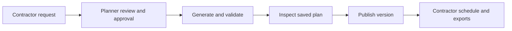

<a id="readme-top"></a>

<div align="center">
  <h1>RailPlan</h1>
  <p><strong>Turn competing maintenance requests into a plan schedulers can explain.</strong></p>
  <p>A rail-maintenance planning prototype for Nebula X PS1: AI Maintenance Scheduler.</p>
  <p>
    <a href="docs/PROJECT_BRIEF.md"><strong>Read the product brief</strong></a>
    <br />
    <a href="https://railplan-nine.vercel.app/ps1">Open the public PS1 scheduler</a>
    &middot;
    <a href="https://github.com/pavan2184/LTA-Hack/issues/new">Report a bug</a>
    &middot;
    <a href="https://github.com/pavan2184/LTA-Hack/issues/new">Suggest a feature</a>
  </p>
</div>

<p align="center">
  
  
  
  
</p>

> **Prototype boundary:** requests and engineering rules are fabricated. Results
> are checked against the encoded model, not authoritative LTA operating rules.
> RailPlan does not grant permission to access track or carry out work.

<details>
  <summary>Table of contents</summary>
  <ol>
    <li><a href="#about-the-project">About the project</a></li>
    <li><a href="#built-with">Built with</a></li>
    <li><a href="#getting-started">Getting started</a></li>
    <li><a href="#usage">Usage</a></li>
    <li><a href="#how-scheduling-works">How scheduling works</a></li>
    <li><a href="#verification">Verification</a></li>
    <li><a href="#roadmap">Roadmap</a></li>
    <li><a href="#documentation">Documentation</a></li>
    <li><a href="#contributing">Contributing</a></li>
    <li><a href="#license">License</a></li>
    <li><a href="#contact">Contact</a></li>
    <li><a href="#acknowledgments">Acknowledgments</a></li>
  </ol>
</details>

## About the project

The PS1 challenge describes maintenance, upgrades and renewals "squeezed into short
engineering hours when services pause, flooding schedulers with competing track
requests". A scheduler must reconcile track access, compatible work and available
engineers; a change that fixes one clash can create another elsewhere. This is the
coordination problem behind [Nebula X's PS1 challenge](https://nebulax.com.sg/#ps-1).

Rules-based conflict checking on track access is **already deployed in Singapore**.
SMRT's Track Access Management System has run on the North-South and East-West Lines
since 2021 and reached the Circle Line by 2025, checking each scheduled track access
request against safety requirements.

**RailPlan addresses the next step: resolving contention between competing requests
for a shared resource, and naming the constraint that bound.** Testing one request
against safety rules is a different problem from deciding which of two requests gets
a block they both need. The intended benefit is less time spent reconciling requests
and a clearer record of what was agreed. That benefit still needs measurement with
real planners. Claims and their evidence are recorded in
[PS1_EVIDENCE_BASE.md](docs/PS1_EVIDENCE_BASE.md).



The fabricated baseline contains **22 requests, 12 atomic track blocks and a
four-hour engineering window**. These are demo inputs, not universal rail rules.
For example, work spanning `NS10–NS12` and `NS11–NS13` shares block `NS11–NS12`;
different sector labels do not prevent a collision.

| Need                       | What RailPlan provides                                                                           |
| -------------------------- | ------------------------------------------------------------------------------------------------ |
| Collect usable requests    | Structured contractor intake and optional private proposals extracted from meeting text          |
| Keep decisions accountable | Planner review, explicit approval and immutable request revisions                                |
| Find feasible schedules    | Five objective profiles using the same constraint validator                                      |
| Understand the result      | Linked Gantt, workforce, request and geographic views, plus inspectable metric formulas          |
| Share the agreed version   | Immutable saved plans, publication history, contractor-scoped access and JSON/CSV exports        |
| Explore alternatives       | A separate sandbox for conflict repairs, exact pins, alternative slots and disruption replanning |
| Explain and notify         | Optional engine-grounded assistant and separately audited Telegram delivery                      |

The scheduler remains responsible for decisions. Generative AI assists with reviewed
intake and language; deterministic code checks feasibility. The geographic view
provides orientation, not an authoritative operational topology.

### Built with

| Layer                    | Technology                                                                  |
| ------------------------ | --------------------------------------------------------------------------- |
| Application              | Next.js 16, React 19, TypeScript 6                                          |
| Interface                | Tailwind CSS 4, Radix UI, Recharts, Zustand                                 |
| Planning                 | Pure TypeScript `@railplan/core` validator, heuristic solver and analytics  |
| Identity and persistence | Supabase Auth, PostgreSQL and row-level security                            |
| Optional integrations    | Anthropic SDK for language/extraction; Telegram Bot API for delivery        |
| Verification             | Vitest, Testing Library, hosted database and production HTTP journey suites |

<p align="right"><a href="#readme-top">Back to top</a></p>

## Getting started

### Prerequisites

- Node.js **22.13+ on the 22.x line**, or **24.x**, with npm. The local verification
  used Node 22.22.0; these minimums cover the installed test tooling.
- A dedicated hosted RailPlan development database with Supabase Auth.
- A confirmed account provisioned with a planner or contractor role.

The app runs directly in Node.js. **No Docker is used.** There is no automatic
public signup or default online password. Missing identity configuration blocks
workspace access, including the sandbox.

### Installation

```bash
git clone https://github.com/pavan2184/LTA-Hack.git
cd LTA-Hack
npm ci
cp .env.example .env.local
chmod 600 .env.local
```

For a fresh clone, uncomment and populate the documented settings in `.env.local`:

| Variable                               | Purpose                                                      |
| -------------------------------------- | ------------------------------------------------------------ |
| `DATABASE_URL`                         | Server-only connection to the dedicated development database |
| `NEXT_PUBLIC_SUPABASE_URL`             | Auth endpoint for that same project                          |
| `NEXT_PUBLIC_SUPABASE_PUBLISHABLE_KEY` | Public client key; never a service-role or secret key        |
| `ANTHROPIC_API_KEY`                    | Optional language assistant and meeting-text extraction      |
| `TELEGRAM_BOT_TOKEN`                   | Optional server-only notification delivery                   |

Keep `.env.local` and credentials out of Git. Follow the [teammate handoff](docs/TEAM_HANDOFF.md)
to apply migrations and provision confirmed users. For a **new, dedicated empty
development database**, an operator bootstraps it with:

```bash
npm run db:migrate
npm run db:seed
npm run db:verify
```

For an existing shared RailPlan database, coordinate with its owner; do not reset
or reseed it. The seed command refuses existing workflow records. Then start the app:

```bash
npm run dev
```

Open the public PS1 workspace at [localhost:3000/ps1](http://localhost:3000/ps1),
or open [localhost:3000](http://localhost:3000) and sign in for the durable RailPlan
workspace. Without AI credentials,
manual intake and scheduling work; the sandbox assistant uses deterministic
answers. Meeting-text extraction requires `ANTHROPIC_API_KEY`. Missing Telegram
credentials affect delivery, not whether a plan can be saved or published.

<p align="right"><a href="#readme-top">Back to top</a></p>

## Usage

The PS1 scheduler at `/ps1` is public and requires no account. It sends uploaded
instances to a native CP-SAT service, with local validation before display/export.
The [existing hosted demo](https://railplan-nine.vercel.app/ps1) is not assumed to
contain this change; deploy the Node/Python runtime using the
[native runbook](docs/PS1_NATIVE_DEPLOYMENT.md). The separate durable
[RailPlan workspace](https://railplan-nine.vercel.app/login) requires provisioned access.
See [current status](docs/PROJECT_STATUS.md) for differences between the hosted deployment,
GitHub and local work.

After a solve, `/ps1` opens Scenario C in an exception-first operations workspace.
Use the policy cards to switch A/B/C without comparing their unlike objectives as
one ranking; use the attention queue and location-by-week grid to drive the shared
inspector. The intended demo path is: select a capacity hotspot, impose urgent
maintenance, review the minimum-churn proposal, then apply or undo it. Proof,
external-submission checking, the exact nine-file ZIP and a separate handover are
available from the persistent command bar. On mobile, the workspace supports
triage, inspection, review and export; dense matrix editing remains a larger-screen task.

### Contractor to planner

1. **Contractor:** open `/contractor`, create a draft, complete the required details
   and submit it. Meeting-text proposals stay private until explicitly submitted.
2. **Planner:** open `/requests`, inspect the submission, assign planning fields
   and approve it, or return/reject it. Only active approved revisions enter planning.
3. **Planner:** open `/plans`, select the engineering night and objective, then
   generate a saved version. Inspect placements, deferred work, workforce and formulas.
4. **Planner:** publish a current, independently validated version. Missing mandatory
   work or stale source facts prevents publication. Delivery status is reported separately.
5. **Contractor:** inspect the organisation's published slots. Planners can download
   JSON/CSV artifacts for the exact saved version.

### Explore scheduling decisions

Open `/sandbox` as a planner and load the fabricated requests. One dashboard combines
the queue, timeline, inspector, conflicts, expandable workforce and scenarios.
Older sandbox subpage URLs redirect to the matching dashboard sections.

Inspect a conflict and its interval, try a validated fix or alternative, generate a
schedule, pin a commitment, then test a disruption. Changes remain in the exploratory
sandbox and do not modify approved requests or saved plans. An impossible mandatory
job stays visible as a blocker.

<p align="right"><a href="#readme-top">Back to top</a></p>

## How scheduling works

The [solver](packages/core/src/engine/solve.ts) uses deterministic, dependency-aware
insertion with bounded repair at 15-minute resolution. It places exact pins first,
orders remaining work by objective, tries candidate slots and independently validates
the complete result. The [validator](packages/core/src/engine/validate.ts) is the
only feasibility authority; the model never approves a schedule.

Five profiles change placement preferences: **Balanced**, **Maximum completion**,
**Minimum risk**, **Minimum changes** and **Emergency reserve**. Minimum changes
measures movement from requested times; it is not a general published-plan repair objective.

<details>
  <summary>The 13 encoded constraint rules</summary>

| Rule                 | Constraint                                            |
| -------------------- | ----------------------------------------------------- |
| `BLOCK_CAPACITY`     | Atomic track occupancy, including clearance           |
| `CONFLICT_ZONE`      | Shared isolation or crossover capacity                |
| `ADJACENT_WORK`      | Hazard separation across neighbouring blocks          |
| `TEAM_CAPACITY`      | Concurrent crew assignments                           |
| `WORKFORCE_CAPACITY` | Anonymous role headcounts and defined staffing demand |
| `EQUIPMENT_CAPACITY` | Serviceable units and turnaround                      |
| `SKILL_COVERAGE`     | Assigned-team skill requirements                      |
| `WORK_COMPATIBILITY` | Permitted combinations of simultaneous work           |
| `DEPENDENCY_ORDER`   | Predecessor completion, clearance and lag             |
| `TIME_WINDOW`        | Request and engineering-window bounds                 |
| `HANDBACK`           | Completion and clearance before the deadline          |
| `TRAVEL_TIME`        | Travel between jobs for single-crew teams             |
| `SHIFT_AVAILABILITY` | Team shifts and withdrawals                           |

</details>

This is a heuristic, not a CP-SAT/MILP solver or proof of global optimality. The
implementation reports `FEASIBLE` or `INFEASIBLE`; its limited `OPTIMAL` label is
used only when all requests take their first-choice candidates with no deferrals.
It does not establish a general optimality bound. Crews are not reassigned, and
travel checks cover single-crew teams only. See the [architecture](docs/ARCHITECTURE.md).

## Verification

```bash
npm test
npm run test:db
npm run lint
npm run typecheck
npm run build
npm run test:e2e
```

Run these serially against the dedicated development database. `test:db` requires
parity and exercises real authorization and concurrency. The separate
[HTTP E2E suite](scripts/e2e/README.md) starts a production server on port 3101,
uses controlled provider responses, and removes its exact fixtures. Read its
preflight requirements before running it.

Ordinary tests may skip unreachable database checks; a green `npm test` alone is
not the release gate. [Testing](docs/TESTING.md) defines browser/accessibility and
release requirements; [current status](docs/PROJECT_STATUS.md) records dated results
and unresolved checks. Controlled provider responses do not prove live delivery.

## Roadmap

- [x] Deterministic scheduling, conflict detection and validated sandbox alternatives.
- [x] Contractor intake, private transcript proposals and planner approval.
- [x] Workforce constraints, saved versions, publication, scoped delivery and exports.
- [x] Integrated role workspaces and one shared-design sandbox dashboard.
- [ ] [#17 — Finish release security, accessibility and end-to-end verification](https://github.com/pavan2184/LTA-Hack/issues/17).
- [ ] [#18 — Consented voice capture and transcription](https://github.com/pavan2184/LTA-Hack/issues/18).
- [ ] [#19 — Controlled Drive and meeting-source imports](https://github.com/pavan2184/LTA-Hack/issues/19).
- [ ] [#20 — Benchmark the heuristic against CP-SAT](https://github.com/pavan2184/LTA-Hack/issues/20).
- [ ] [#21 — Evaluate named crew rostering and reassignment](https://github.com/pavan2184/LTA-Hack/issues/21).

Follow the numbered issue order. #21 is a scope decision, not authorization to
collect named-worker data. Additional local improvements and remaining evidence
gaps are recorded in [project status](docs/PROJECT_STATUS.md).

## Documentation

- [PS1 official spec](docs/PS1_OFFICIAL_SPEC.md) — **authoritative** rules, scenarios, scoring, output schema, judging rubric and deliverables. Read this first.
- [Product brief](docs/PROJECT_BRIEF.md) — the problem, users, intended workflow and success criteria.
- [Participant context](docs/NEBULAX_PARTICIPANT_CONTEXT.md) — event logistics, deadlines and attendance.
- [Product research](docs/NEBULAX_PRODUCT_RESEARCH.md) — dated comparisons, operator questions and proposals.
- [Architecture](docs/ARCHITECTURE.md), [data model](docs/DATA_MODEL.md) and [API contract](docs/API_CONTRACT.md).
- [Project status](docs/PROJECT_STATUS.md), [testing](docs/TESTING.md) and [security review](docs/SECURITY_REVIEW.md).
- [Full documentation index](docs/README.md).

PS1's own problem statement asks for four deliverables: **pre-computed results**
for the provided dataset, a **hosted live app** judges can upload a hidden
eight-CSV instance into, a **3-minute YouTube video**, and a **GitLab repository
URL**. The participant pack's generic list differs — GitHub, a 2–3 minute video,
a write-up and a results ZIP — and those conflicts are unresolved; both are
tabulated in the [PS1 official spec](docs/PS1_OFFICIAL_SPEC.md#1-deliverables--what-we-must-hand-over).
Everything is due **19 September 2026, 16:00 Singapore time**, with in-person
submission sign-in from 14:30.

## Contributing

Read [AGENTS.md](AGENTS.md) and the project contracts before changing code. Discuss
new scope in an issue, work on a focused branch (for example,
`PinZheng/describe-the-change`), and submit a pull request with the rationale and
verification results. Use `<area>(<type>): <summary>` for commit and PR titles.

Reuse existing patterns, preserve the validator boundary, add tests for backend
changes and update the relevant contracts/status. Keep credentials and private
participant material out of commits. The project uses a hosted development
database; coordinate tests that share its planning-source lock.

## License

This repository currently has no project licence file. The README template's
licence does not set RailPlan's licence. Third-party code and data retain their
own terms. The geographic snapshot has an unresolved source-permission conflict;
see [the security review](docs/SECURITY_REVIEW.md) before redistributing it.

## Contact

Use [GitHub Issues](https://github.com/pavan2184/LTA-Hack/issues) for project questions,
bugs and feature discussions. Project repository: [pavan2184/LTA-Hack](https://github.com/pavan2184/LTA-Hack).

## Acknowledgments

- [Nebula X / LTA Rail Digitalisation and Guild](https://nebulax.com.sg/) for the challenge framing.
- [Best-README-Template](https://github.com/othneildrew/Best-README-Template) for the README structure.
- The open-source projects listed above and the primary sources credited in [product research](docs/NEBULAX_PRODUCT_RESEARCH.md).

<p align="right"><a href="#readme-top">Back to top</a></p>
