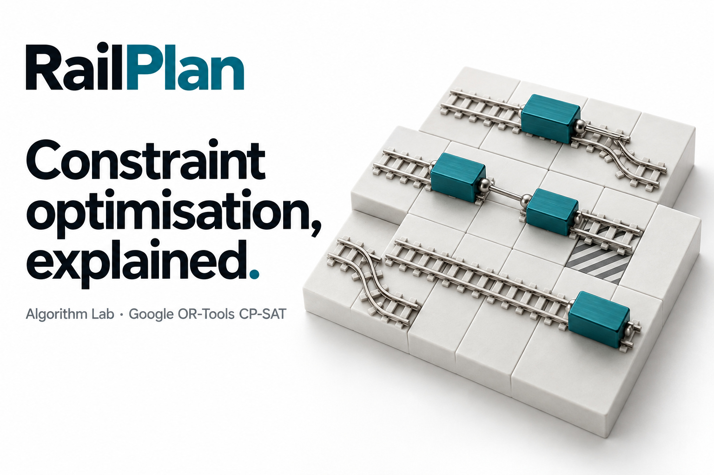

<a id="readme-top"></a>

<div align="center">
  <h1>RailPlan Algorithm Lab</h1>
  <p><strong>Railway access planning, explained.</strong></p>
  <p>Devpost gallery and copy · 19 September 2026</p>
  <p><a href="captions.md">Captions, alt text and narration</a> · <a href="source/gallery.html">Editable gallery</a></p>
</div>

<details>
  <summary>Table of Contents</summary>
  <ol>
    <li><a href="#about-the-project">About The Project</a></li>
    <li><a href="#getting-started">Getting Started</a></li>
    <li><a href="#usage">Usage</a></li>
    <li><a href="#roadmap">Roadmap</a></li>
    <li><a href="#contributing">Contributing</a></li>
    <li><a href="#license">License</a></li>
    <li><a href="#contact">Contact</a></li>
    <li><a href="#acknowledgments">Acknowledgments</a></li>
  </ol>
</details>

## About The Project



This pack introduces **RailPlan Algorithm Lab**, an interactive teaching model
that uses real Google OR-Tools CP-SAT solves to schedule six fictional maintenance
jobs across eight weeks. It explains how a model becomes a checked schedule and
how changing capacity or closing a week changes the result.

**Capture and deployment status:** the application screenshots were captured
locally. Cloud Run deployment is prepared, but requires an authenticated account
and a selected team-controlled Google Cloud project; no public Cloud Run URL is
verified. These assets do not claim cloud deployment.

The Algorithm Lab is separate from **RailPlan `/ps1`**, which uses native Python
OR-Tools CP-SAT with a checked TypeScript warm start for uploaded eight-file
instances and scenarios A/B/C. The lab's simplified model, objective values and timings are not PS1
benchmark results, reference-validator results or operational safety approval.
The lab does not implement track geometry, buffers, Live mirroring, co-sharing or
ECLO. See the [application README](../../../demos/algorithm-lab/README.md).

### Built With

- Python and Google OR-Tools CP-SAT 9.15.6755, with Flask and Gunicorn.
- Native HTML, CSS and JavaScript; locally bundled IBM Plex fonts.
- Actual application captures for product images and native HTML/SVG diagrams
  for the explanation. The cover is a generated conceptual illustration, not a
  screenshot or real railway map.

<p align="right"><a href="#readme-top">Back to top</a></p>

## Getting Started

### Prerequisites

A browser or image viewer can open the finished images. Use a text editor to
copy or revise the accompanying Markdown. Running the demo requires Python 3.12
and the [documented local setup](../../../demos/algorithm-lab/README.md#run-locally).

### Installation

1. Keep the pack's `images/`, `screenshots/` and `source/` folders together.
2. Review the gallery in the upload order below and use the matching
   [captions and alt text](captions.md).
3. To edit the gallery, open [source/gallery.html](source/gallery.html) from the
   pack. Fonts and their license are bundled under `source/fonts/`, so the
   editable gallery also works after extracting the ZIP.

<p align="right"><a href="#readme-top">Back to top</a></p>

## Usage

### Devpost upload order

Upload the individual images in this order:

| Order | File | Purpose | Dimensions |
| --- | --- | --- | --- |
| 1 | [01-algorithm-lab-cover.jpg](images/01-algorithm-lab-cover.jpg) | Cover: constraint optimisation, explained | 1536 × 1024 |
| 2 | [02-how-cp-sat-works.png](images/02-how-cp-sat-works.png) | Three-step explanation | 1920 × 1080 |
| 3 | [03-interactive-demo.png](images/03-interactive-demo.png) | Default schedule: every access accounted for | 1920 × 1080 |
| 4 | [04-close-a-week.png](images/04-close-a-week.png) | Week-two closure and its consequences | 1920 × 1080 |
| 5 | [05-proof.png](images/05-proof.png) | Solver status, bound and independent checks | 1920 × 1080 |

The editable gallery uses a fixed 1920 × 1080 canvas. Select its page with
`?slide=process`, `?slide=demo`, `?slide=disruption` or `?slide=proof`. Product images
contain the supplied screenshots without changing their displayed content.
Unframed captures are in [screenshots/](screenshots/), including a separate
infeasible-state capture.

From the repository root, regenerate the four gallery exports and ZIP with:

```sh
node scripts/algorithm-lab/render-gallery.mjs /path/to/playwright/index.mjs
python3 scripts/algorithm-lab/package_assets.py
```

The ZIP is written to `output/railplan-algorithm-lab-devpost.zip`.
[manifest.json](manifest.json) records file sizes, image dimensions and SHA-256
checksums. [source/render-checks.json](source/render-checks.json) records layout
and font/image-loading checks for the four gallery exports.

### How CP-SAT works: the three-step explanation

**1. Model the work.** CP means constraint programming; SAT means satisfiability.
Six jobs across eight weeks become **48 binary placement variables**: each says
whether a job receives an access in that week. All nine required accesses must
be scheduled. Weekly capacity, closures, one access per job per week, and enabled
predecessor rules are hard constraints. Completion and lateness use integer
variables. The objective minimises **the sum of weeks late × priority weight**.
[About CP-SAT](https://developers.google.com/optimization/cp)

**2. Search within the rules.** Propagation rules out choices that cannot work.
The solver branches on remaining choices and learns from conflicts to avoid
incompatible combinations. It keeps the best valid schedule found—the
**incumbent**—and a **lower bound** on the smallest possible cost. Improving
either narrows the remaining uncertainty. This is a conceptual explanation;
the gallery does not show a recorded trace of the solver's internal search.
[Solver internals](https://github.com/google/or-tools/blob/stable/ortools/sat/README.md)

**3. Prove and explain the answer.** **OPTIMAL** means the lowest cost has been
proved for this model; **FEASIBLE** means a valid schedule was found without
proving it best. When cost meets bound, the gap is closed. A separate checker
recomputes workload, capacity, precedence and score. With default settings, A06
runs in weeks 5–6 after A03 finishes in week 4: one week late × weight 3 = **3
penalty points**. The complete default schedule costs 5.
[Solver statuses](https://developers.google.com/optimization/cp/cp_solver)

### Paste-ready Devpost copy

**RailPlan Algorithm Lab — constraint optimisation, explained.**

Railway access planning combines limited capacity, dependent work and competing
deadlines. RailPlan Algorithm Lab makes those scheduling decisions visible in an
interactive CP-SAT demonstration.

We turn six fictional jobs and eight weeks into 48 yes-or-no placement decisions.
Every required access stays in the model. Google OR-Tools searches for the lowest
weighted lateness while respecting the selected capacity, closure and predecessor
rules. The result includes a schedule, job-level explanations, the objective and
the solver's best bound. A separate checker verifies the returned schedule and
recalculates its score.

With default settings, all six jobs and all nine accesses are scheduled at a
proved minimum cost of 5. Closing week two raises that minimum to 19. The captured
comparison changes four jobs' access weeks while retaining the full workload.

The Algorithm Lab is an educational companion to RailPlan's full PS1 planner,
which solves uploaded competition instances through a separate native CP-SAT
service seeded by a checked TypeScript heuristic. These images show the locally verified lab.
Google Cloud Run deployment is prepared; a public cloud URL is pending.

**Built with:** Python, Google OR-Tools CP-SAT, Flask, Gunicorn, JavaScript,
HTML/CSS and IBM Plex. Cloud Run configuration is supplied as a deployment target.

### Narration

Use the [approximately 60-second demo narration](captions.md#60-second-demo-narration)
with the default solve, the three-step explanation, the week-two closure and
the proof view. This is a recording script, not a completed video or measured
audio track. It does not replace the competition's required three-minute demo.

<p align="right"><a href="#readme-top">Back to top</a></p>

## Roadmap

- [ ] Select the intended Google Cloud account and project, deploy, and verify
  the public URL before making a hosted-on-Cloud-Run claim.
- [ ] Capture the verified public deployment if hosted screenshots are required.
- [ ] Record the narration and publish the completed demonstration.
- [ ] Upload the selected images and current copy to Devpost.

<p align="right"><a href="#readme-top">Back to top</a></p>

## Contributing

Update [source/gallery.html](source/gallery.html) for layout changes and recapture
the application when product states change. Preserve the distinction between the
Algorithm Lab and the complete PS1 planner. Recheck numbers, captions and links
against the captured result before regenerating images.

<p align="right"><a href="#readme-top">Back to top</a></p>

## License

No separate project or asset license is granted by this pack. The README template's
license does not apply to RailPlan's code or images. IBM Plex's bundled font
license is available in [OFL.txt](source/fonts/OFL.txt).

<p align="right"><a href="#readme-top">Back to top</a></p>

## Contact

Project: [pavan2184/LTA-Hack](https://github.com/pavan2184/LTA-Hack).
Use [repository issues](https://github.com/pavan2184/LTA-Hack/issues) for corrections.

<p align="right"><a href="#readme-top">Back to top</a></p>

## Acknowledgments

- [Google OR-Tools](https://developers.google.com/optimization/) for CP-SAT and
  its public documentation.
- [IBM Plex](https://github.com/IBM/plex) for the typefaces.
- [Best-README-Template](https://github.com/othneildrew/Best-README-Template) for
  this document's structure.
- [Nebula X PS1](https://github.com/aochinwen/NebulaX-Hackathon-ProblemStatement/tree/main/PS1)
  for the wider planning challenge; the Algorithm Lab uses its own fictional,
  simplified teaching instance.

<p align="right"><a href="#readme-top">Back to top</a></p>
