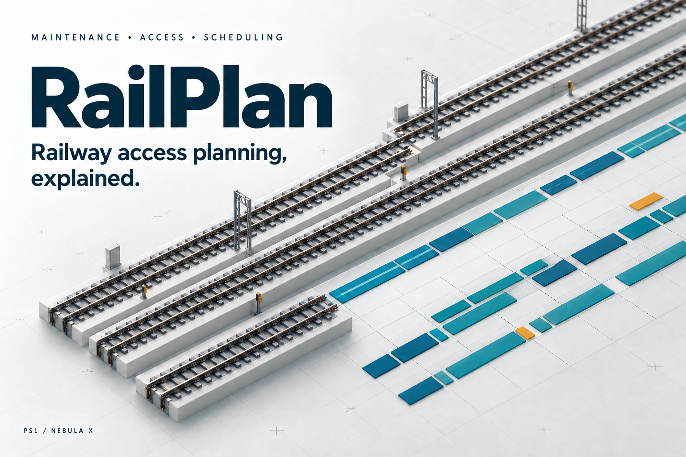

  <h1>RailPlan</h1>
  
<strong>Railway access planning, explained.</strong>

  
Devpost asset pack · 19 September 2026

  

    <a href="index.html"><strong>Preview the assets »</strong></a>
      
    <a href="copy/devpost-copy.md">Project copy</a>
    &middot;
    <a href="copy/captions.md">Captions and alt text</a>
    &middot;
    <a href="https://github.com/pavan2184/LTA-Hack/issues">Report an issue</a>
  

  
Table of Contents

  <ol>
    <li><a href="#about-the-project">About The Project</a>
      <ul><li><a href="#built-with">Built With</a></li></ul>
    </li>
    <li><a href="#getting-started">Getting Started</a>
      <ul>
        <li><a href="#prerequisites">Prerequisites</a></li>
        <li><a href="#installation">Installation</a></li>
      </ul>
    </li>
    <li><a href="#usage">Usage</a></li>
    <li><a href="#roadmap">Roadmap</a></li>
    <li><a href="#contributing">Contributing</a></li>
    <li><a href="#license">License</a></li>
    <li><a href="#contact">Contact</a></li>
    <li><a href="#acknowledgments">Acknowledgments</a></li>
  </ol>

## About The Project

Six finished images, project copy and editable source material for presenting the RailPlan PS1 schedule workspace captured on 19 September 2026. The pack contains a cover, four product gallery images and a social square.

### Built With

- Built-in image generation for the cover and square artwork.
- Actual browser captures from the RailPlan production build for product screenshots.
- HTML/CSS for the gallery frames and local preview; Markdown for submission copy.

**Capture version.** These images preserve the captured UI and scores. Later solver improvements in PR #48 changed the local public Policy C score from 39.2 to 25.2; use the [current benchmark](https://github.com/pavan2184/LTA-Hack/blob/main/docs/PS1_BENCHMARK.md) for current results.

**Provenance.** Product screenshots use the published eight-file instance at application commit `fc69249c9a8fdaee85b15dccef7c80b8c2726bde`. The layout omits the policy-description strip. Policy C is selected, with all A/B/C metrics expanded in the comparison image. The explanation selects A004, which starts in week 16 after A003 finishes in week 15. Change review shows an unapplied capacity-cut proposal; the original plan remains in place until Apply.

The cover and square are conceptual railway illustrations, not a real railway map or application interface. The cover was refined to remove invented day labels from its abstract planning grid. This repository copy uses a full-resolution JPEG export of the generated PNG to meet the repository’s 2 MB per-file limit; the original PNG remains in the local sharing pack. Product screenshot content was neither generated nor rewritten. Browser captures were converted to PNG without changing their content; minor capture dimensions reflect browser rendering.

<a href="#readme-top">Back to top</a>

## Getting Started

### Prerequisites

A browser and a text editor are sufficient to preview the pack and copy its text. No app installation, account, API key or database is needed to use these files.

### Installation

1. Extract the asset ZIP, preserving its folder structure.
2. Open [index.html](index.html) in your browser.
3. Review [project copy](copy/devpost-copy.md) and [captions](copy/captions.md) before submitting.

<a href="#readme-top">Back to top</a>

## Usage

Upload individual files from [images/](images/), rather than the ZIP, to Devpost. Use this order:

| File | Use | Dimensions |
| --- | --- | --- |
| [01-railplan-cover.jpg](images/01-railplan-cover.jpg) | Project thumbnail / cover | 1536 × 1024 (3:2) |
| [02-work-schedule.png](images/02-work-schedule.png) | Gallery 1 — See the whole plan | 1920 × 1080 |
| [03-explanations.png](images/03-explanations.png) | Gallery 2 — Understand the placement | 1920 × 1080 |
| [04-change-review.png](images/04-change-review.png) | Gallery 3 — Review before applying | 1920 × 1080 |
| [05-policy-comparison.png](images/05-policy-comparison.png) | Gallery 4 — Compare trade-offs | 1920 × 1080 |
| [06-railplan-social-square.png](images/06-railplan-social-square.png) | Social announcement | 1254 × 1254 |

Devpost recommends a 3:2 thumbnail and accepts JPG, PNG or GIF up to 5 MB. The cover is a high-quality JPEG; all six images are below 5 MB. These requirements were checked on 19 September 2026 against [Devpost's submission steps](https://help.devpost.com/article/126-know-your-submission-steps). Individual hackathons may add requirements.

Editable and supporting files:

- [copy/devpost-copy.md](copy/devpost-copy.md): project story, tagline and technology list.
- [copy/captions.md](copy/captions.md): gallery captions, alt text and social copy.
- [screenshots/](screenshots/): four unframed application captures.
- [source/gallery.html](source/gallery.html): gallery layout. Open with `?slide=02`, `03`, `04` or `05` at a 1920 × 1080 viewport to recreate the frames.
- [source/generation-prompts.json](source/generation-prompts.json) and [source/social-prompt.txt](source/social-prompt.txt): illustration prompts and refinement record.
- [manifest.json](manifest.json): dimensions, file sizes and SHA-256 checksums.

The pack has not been uploaded or published. It contains no video and is separate from the required nine-CSV solver-results ZIP. Add the final verified demo URL to the submission copy when available.

<a href="#readme-top">Back to top</a>

## Roadmap

- [x] Create and visually review all six images for clipping, spelling, headline readability and alignment with captured product states.
- [x] Verify image formats, dimensions, thumbnail ratio and file sizes.
- [x] Capture production build `fc69249`; no new application regression test run is claimed for this asset-only work.
- [ ] Add the verified hosted demo and video URLs to the submission.
- [ ] Upload the chosen assets and copy through the relevant submission portal.

<a href="#readme-top">Back to top</a>

## Contributing

Suggest corrections through [repository issues](https://github.com/pavan2184/LTA-Hack/issues). For asset revisions, edit the supplied source, preserve genuine product captures, review the rendered results and refresh the manifest. Keep claims consistent with the PS1 prototype; the local checker is not the organiser's reference validator or operational approval.

<a href="#readme-top">Back to top</a>

## License

No separate license is included in this asset pack. This README does not grant a license or apply the README template's license to RailPlan's code or assets. Confirm reuse permissions with the project maintainers.

<a href="#readme-top">Back to top</a>

## Contact

Use [RailPlan's repository issues](https://github.com/pavan2184/LTA-Hack/issues) for questions about this pack. Project source: [pavan2184/LTA-Hack](https://github.com/pavan2184/LTA-Hack).

<a href="#readme-top">Back to top</a>

## Acknowledgments

- [Best-README-Template](https://github.com/othneildrew/Best-README-Template) for this document's structure.
- [Nebula X PS1](https://github.com/aochinwen/NebulaX-Hackathon-ProblemStatement/tree/main/PS1) for the challenge and published instance shown in the product captures.
- [Devpost Help Center](https://help.devpost.com/article/126-know-your-submission-steps) for submission image requirements.

<a href="#readme-top">Back to top</a>

